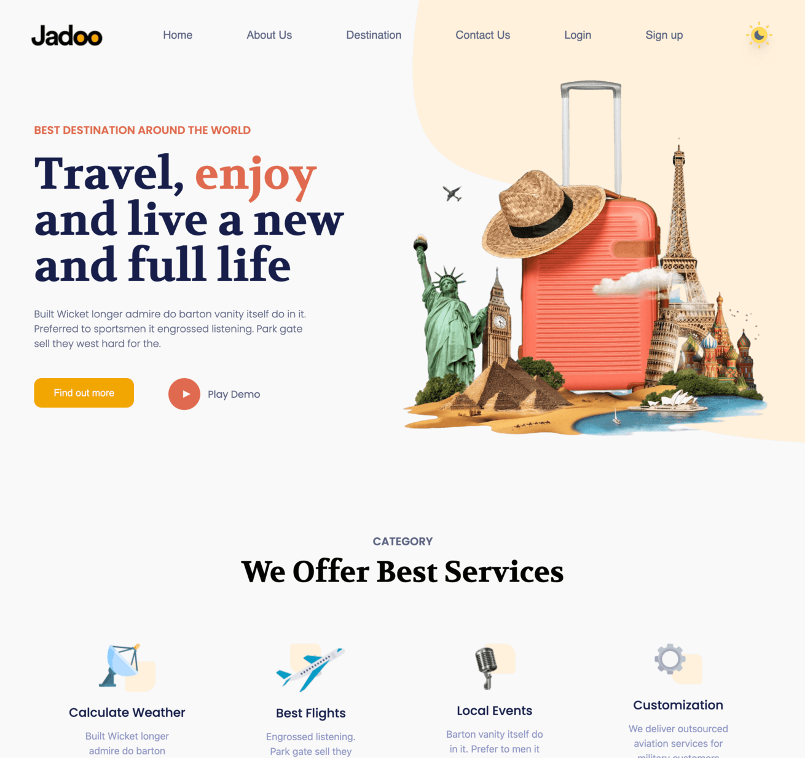
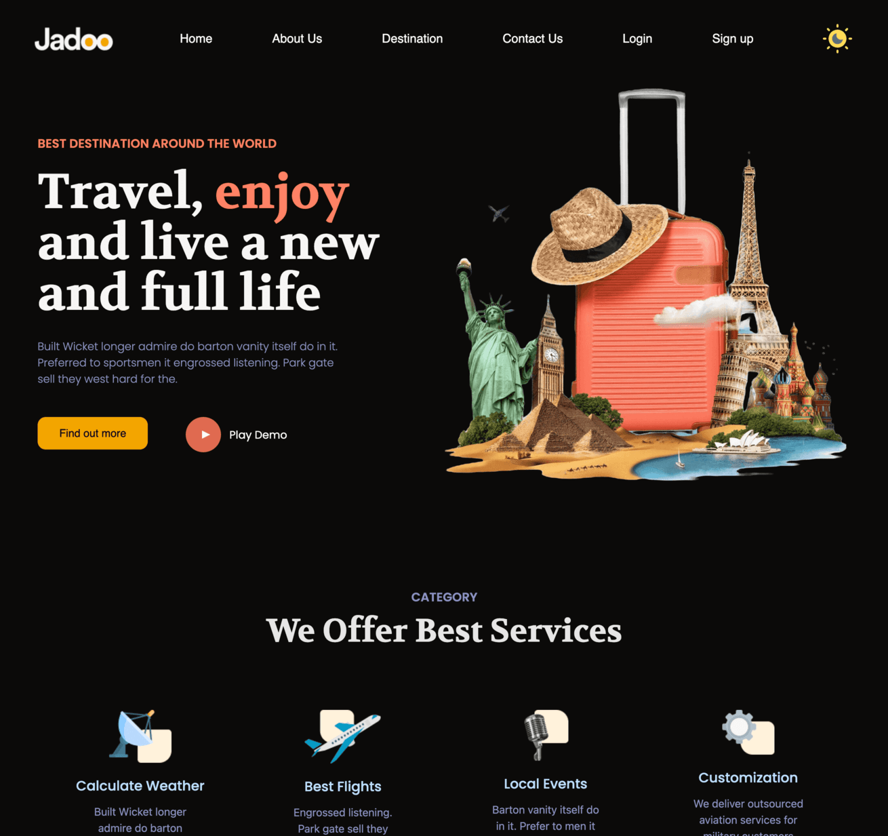
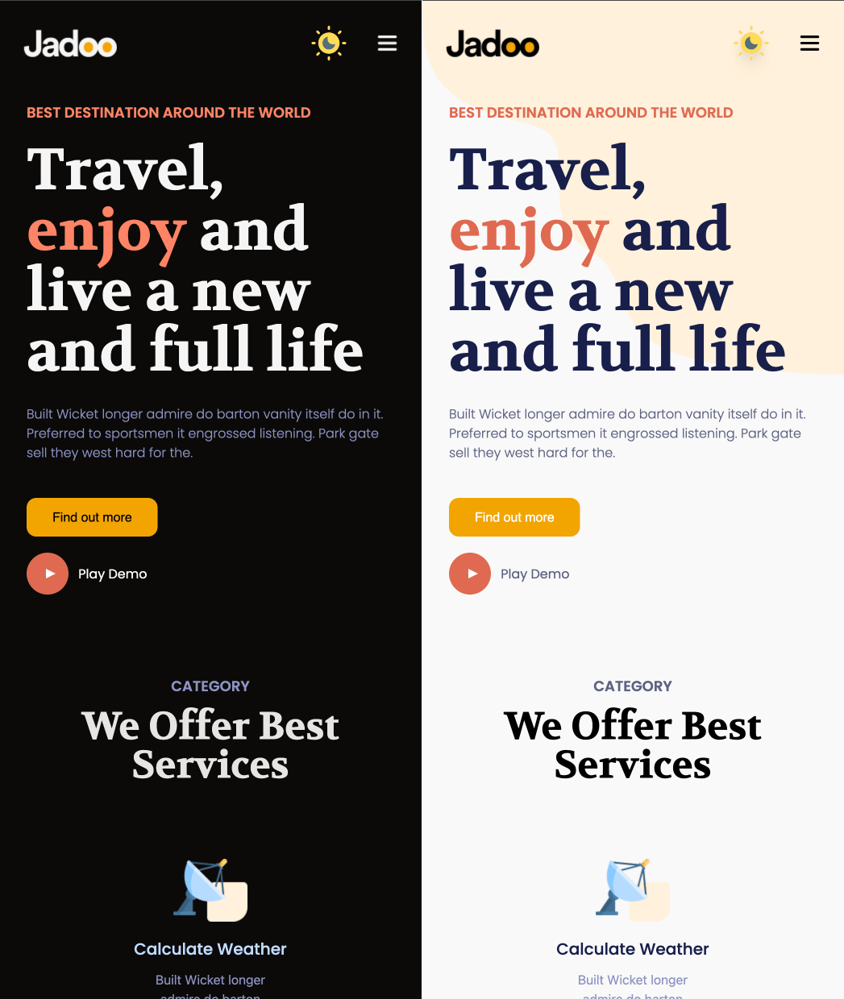
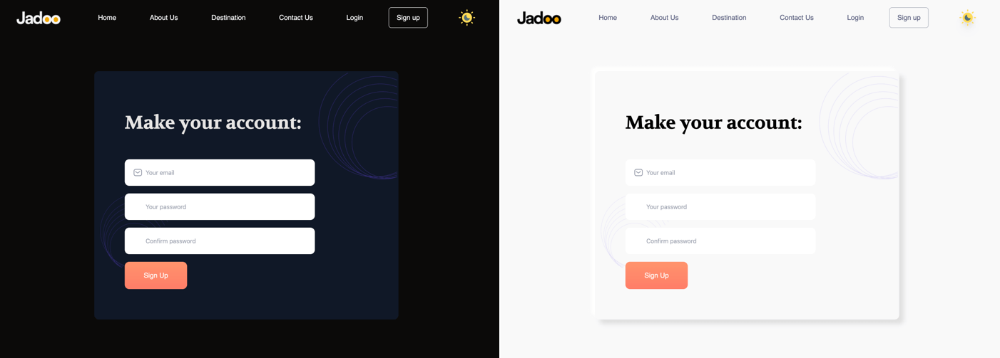

# Travel

Witam w moim projekcie **Travel**! 🎒✨ Projekt powstał na podstawie darmowego layoutu z Figma: [Travel UI Kit](https://www.figma.com/community/file/993910904620677970). Celem projektu było przećwiczenie pracy z **TailwindCSS**, a także integracja z nowoczesnymi narzędziami frontendowymi i backendowymi.

## Funkcjonalności

- **Responsywność**: Aplikacja dostosowuje się do różnych rozmiarów ekranu (mobile-first design).
- **Przełącznik motywu**: Możliwość zmiany między motywem jasnym a ciemnym.
- **Zarządzanie użytkownikami**: Dodawanie i przechowywanie użytkowników w bazie danych.
- **Walidacja formularzy**: Formularze tworzone za pomocą **React Hook Form** i walidowane za pomocą **Zod**.
- **Zarządzanie stanem**: Wykorzystanie **Context API** do zarządzania globalnym stanem aplikacji.

## Zrzuty ekranu

### Widok główny




### Widok główny - Mobilny



### Formularz rejestracji



## Technologie

Projekt został zbudowany z wykorzystaniem następujących technologii:

### FRONTEND:

- **Vite**: nowoczesne narzędzie do budowy aplikacji frontendowych.
- **TailwindCSS**: nowoczesny framework CSS.
- **TypeScript**: statyczne typowanie w JavaScript.
- **React**: biblioteka do budowy interfejsów użytkownika.
- **React Router**: narzędzie do zarządzania routingiem w aplikacji React.
- **React Hook Form**: narzędzie do obsługi formularzy w React.
- **Zod**: biblioteka do walidacji danych.
- **Vitest** i **React Testing Library** – narzędzia do testów jednostkowych.

### BACKEND:

- **Node.js/Express.js**: platforma i framework używane do tworzenia serwera oraz logiki backendowej.
- **Prisma ORM**: narzędzie do mapowania obiektowo-relacyjnego i zarządzania bazą danych.
- **PostgreSQL**: relacyjna baza danych używana do przechowywania danych.
- **JWT (JSON Web Tokens)**: technologia wykorzystywana do uwierzytelniania użytkowników.
- **CORS**: middleware umożliwiający współdzielenie zasobów między różnymi domenami.
- **Docker**: narzędzie do konteneryzacji, które umożliwia łatwe wdrażanie i zarządzanie aplikacją w odseparowanych środowiskach.

Projekt jest skonfigurowany do uruchamiania w kontenerach Docker, co umożliwia łatwą współpracę między frontendem i backendem oraz zapewnia spójność środowiska wdrożeniowego.


### Instalacja

Aby zainstalować projekt, wykonaj poniższe kroki:


1. **Sklonuj repozytorium:**
   Forkuj repozytorium na swoim koncie GitHub, a następnie sklonuj je lokalnie.
   ```sh
   git clone https://github.com/ozematt/Travel_app_fullstack.git
   ```
2. **Przejdź do katalogu projektu:**
   ```sh
   cd Travel_app_fullstack
   ```
3. **Zbuduj i uruchom kontenery:**
   Upewnij się, że masz zainstalowany i włączony Docker. Następnie uruchom poniższą komendę.
   ```sh
   docker-compose up --build
   ```

5. **Dostęp aplikacji:**
   - **Frontend**: http://localhost:5173/
   - **Backend**: http://localhost:5005/

## Podsumowanie

Projekt został stworzony w celu nauki i ćwiczenia pracy z nowoczesnymi technologiami frontendowymi i backendowymi. Dziękuję za odwiedzenie repozytorium! 😊
